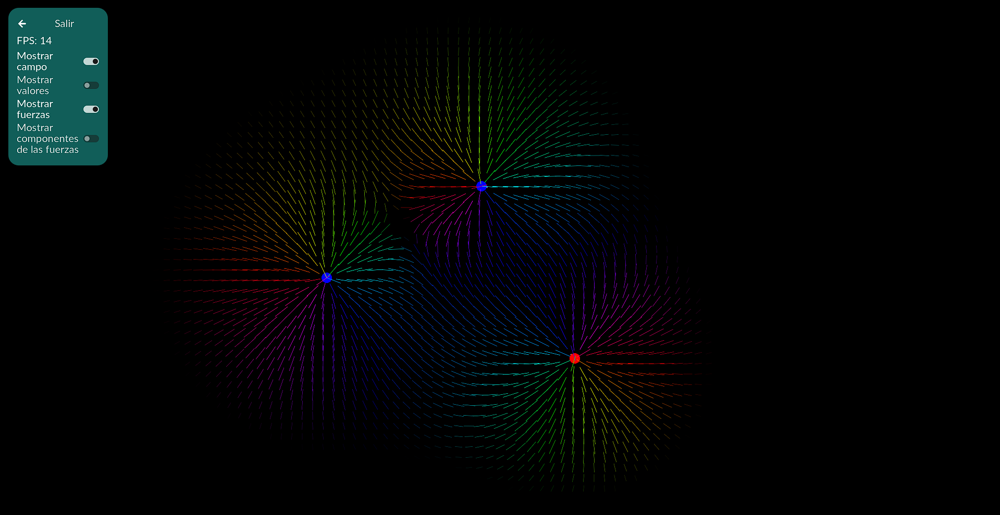

# FEM Simulator
FEM Simulator es un simulador de fenómenos electromagnéticos que permite probar aspectos de la física como cargas, campos, etc.

La **versión 0.1** incluye solo el simulador de campos electrostáticos con funciones básicas. Estaré en proceso de desarrollar las demás funciones, simuladores, correcciones de errores y lo que siga.